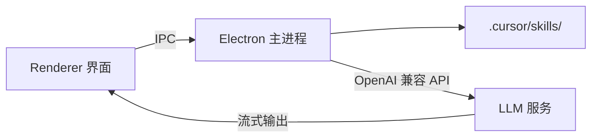

# AI 文章创作 Agent

基于 **Electron** 的桌面应用：用户输入文章主题后，应用会加载 `.cursor/skills/` 中的写作规范，并调用 LLM 流式生成文章。

## 架构



| 层级 | 职责 |
|------|------|
| **Renderer** | React 界面：主题输入、补充要求、流式展示正文 |
| **Main** | 读取 Skills、组装 Prompt、调用 LLM API |
| **Skills** | `.cursor/skills/*/SKILL.md`，定义写作风格与流程 |

## 快速开始

```bash
npm install
copy .env.example .env
# 编辑 .env，填入 LLM_API_KEY
npm run dev
```

## 扩展 Skills

在 `.cursor/skills/` 下新增目录，每个 Skill 包含 `SKILL.md`（YAML frontmatter + 正文），例如：

- `.cursor/skills/article-writing/SKILL.md` — 通用中文长文
- `.cursor/skills/seo-geo-streaming-audio/SKILL.md` — SEO/GEO 英文流媒体音频教程

主进程会在每次创作前自动加载全部 Skills 并注入 system prompt。

## 后续：接入 Cursor SDK 本地 Agent

若希望使用 Cursor 原生 Agent（工具调用、MCP、本地代码库上下文），可安装 `@cursor/sdk` 并在主进程替换 `articleAgent.ts` 的实现。Windows 上需安装 **Visual Studio Build Tools**（C++  workload），因 SDK 依赖原生模块。

## 脚本

| 命令 | 说明 |
|------|------|
| `npm run dev` | 开发模式 |
| `npm run build` | 构建 |
| `npm run typecheck` | 类型检查 |

## 环境要求

- Node.js 20+
- 支持 OpenAI 兼容 Chat Completions 的 API Key
