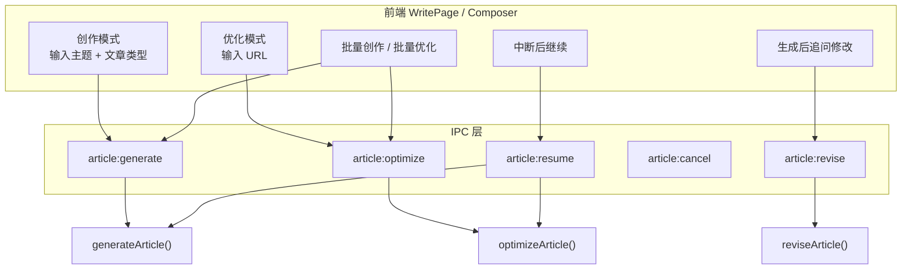
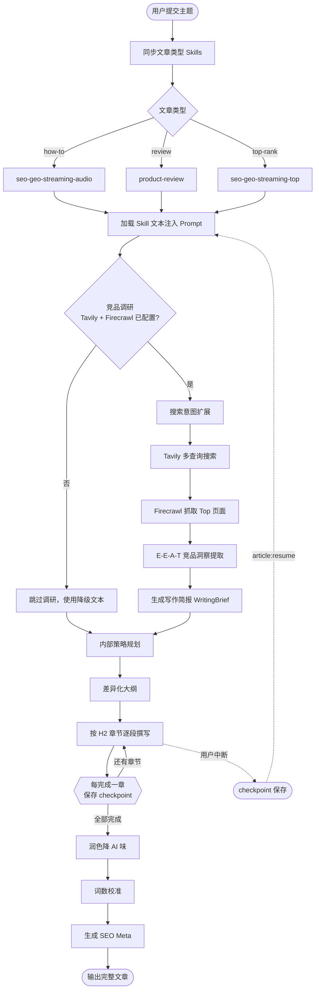
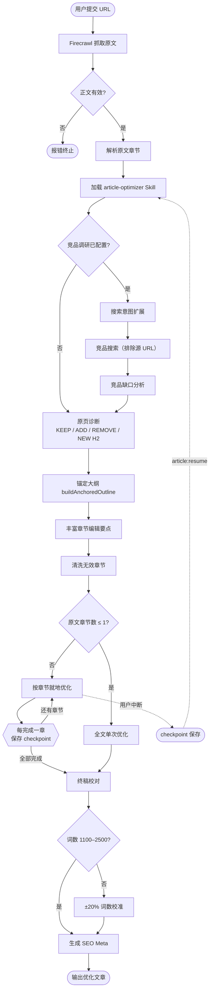
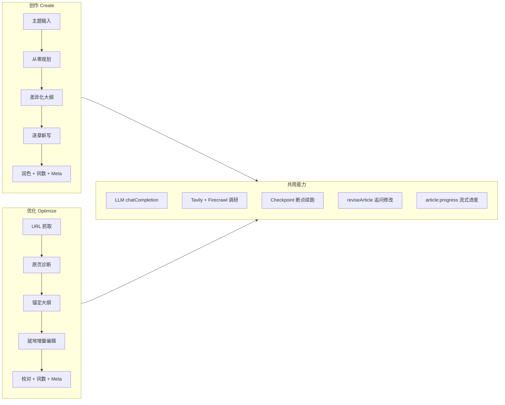
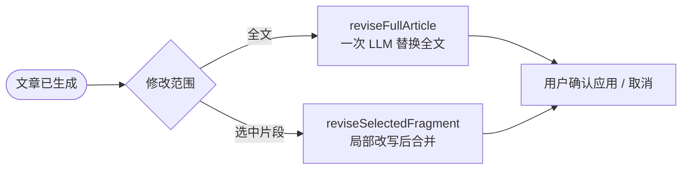
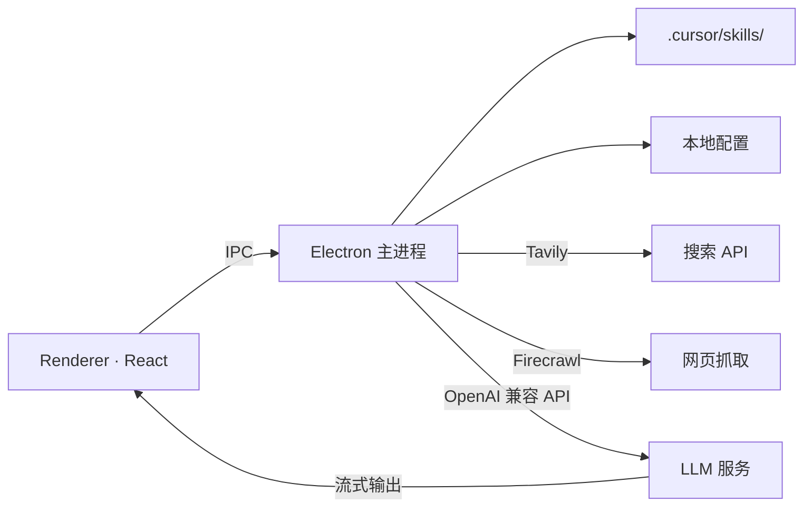

# SEO Article Generate

> **AI 文章创作 Agent** — 基于 Electron 的桌面应用，面向 SEO / GEO 内容生产。支持从零创作、竞品调研、分段写作、文章优化与局部修订，内置可扩展的 Cursor Agent Skills 写作规范。

[](https://github.com/YieCham/seo-article-generate)

---

## 功能概览

| 能力 | 说明 |
|------|------|
| **文章创作** | 输入主题，自动完成调研 → 规划 → 大纲 → 分段撰写 → 润色 → 字数校验 → SEO Meta |
| **文章优化** | 提交原文 URL，抓取正文后做 E-E-A-T 导向的就地优化，吸纳竞品要点、删减过时内容 |
| **局部修订** | 在已生成文章中选中段落，追加修改指令进行针对性改写 |
| **竞品调研** | 集成 Tavily 搜索 + Firecrawl 抓取，自动扩展搜索词并汇总参考来源 |
| **多写作模式** | How-to 教程、Top Rank 榜单、Product Review 测评，自动匹配对应 Skill |
| **多语言输出** | 支持英语、中文、西班牙语、法语、德语、日语 |
| **会话管理** | 多会话并行、重命名、删除确认、历史记录持久化 |
| **Token 管控** | 分步骤 Token 预算、可配置上限、用量日志与离线分析脚本 |
| **LLM 预设** | 多组 API 配置（Base URL / Model / Temperature）一键切换 |
| **Skills 体系** | 基于 `.cursor/skills/` 的可插拔写作规范，创作与优化模式独立启用 |

---

## 写作模式与文章类型

### 写作模式

- **文章创作** — 从零生成新文章，走完整创作 Pipeline
- **文章优化** — 基于 URL 抓取原文，保留骨架做增量 SEO/GEO 优化

### 文章类型（创作模式）

| 类型 | 说明 | 关联 Skill |
|------|------|------------|
| **How to** | 流媒体音频转换等教程软文 | `seo-geo-streaming-audio` |
| **Top rank** | 榜单 / Top N 类英文推广文 | `seo-geo-streaming-top` |
| **Review** | 产品测评对比软文 | `product-review` |

另有独立 Skill `seo-geo-ios-security` 面向 iOS 安全类 SEO/GEO 内容，可在设置中按需启用。

---

## 工作流程

应用采用多阶段流水线，各阶段进度通过 `article:progress` 实时推送到界面。创作与优化均支持 **断点续跑**（checkpoint）与 **生成后追问修改**。

### 总体入口



### 文章创作流程



| 阶段 | 核心函数 | 说明 |
|------|----------|------|
| Skills | `syncCreateSkillsForArticleType` | 按文章类型启用对应 Skill |
| 调研 | `searchWithQueries` | Tavily 搜索 + Firecrawl 抓取 |
| 提取 | `extractEeatInsights` | 竞品 E-E-A-T 洞察 |
| 规划 | `generateArticlePlan` | 内部策略规划 |
| 大纲 | `generateDifferentiatedOutline` | 按类型生成差异化骨架 |
| 撰写 | `draftBySections` | 每章节一次 LLM 调用 |
| 后处理 | polish → length → meta | 润色 → 词数 → SEO 元信息 |

编排入口：`src/main/agent/articleAgent.ts` → `generateArticle()`

### 文章优化流程



| 阶段 | 核心函数 | 与创作的区别 |
|------|----------|--------------|
| 抓取 | `scrapeToMarkdown` | 以 URL 原文为输入，非主题 |
| Skill | `article-optimizer` | 仅启用优化 Skill |
| 诊断 | `auditSourcePage` | 评估原文，给出 KEEP/ADD/REMOVE |
| 大纲 | `buildAnchoredOutline` | 保留原 H2 顺序，增量补充模块 |
| 撰写 | 单章 or 逐章 | 就地编辑，保留优质原文 |
| 词数 | ±20% 源文词数 | 1100–2500 词时跳过校准 |

编排入口：`src/main/agent/articleOptimizer.ts` → `optimizeArticle()`

### 创作 vs 优化



### 生成后追问修改

两条主流程完成后，用户可在 Composer 继续追问：



---

## 架构



| 层级 | 技术栈 | 职责 |
|------|--------|------|
| **Renderer** | React 19 + TypeScript | 写作界面、会话管理、设置页、流式 Markdown 渲染 |
| **Main** | Electron + Node.js | Skills 加载、Prompt 组装、调研、LLM 调用、Token 记录 |
| **Preload** | Context Bridge | 安全的 IPC 桥接 |
| **Skills** | Markdown + YAML | 写作风格、SEO/GEO 规范、优化原则 |

---

## 快速开始

### 环境要求

- **Node.js** 20+
- 支持 **OpenAI 兼容 Chat Completions** 的 API Key
- （可选）Tavily / Firecrawl API Key，用于竞品调研

### 安装与运行

```bash
# 克隆仓库
git clone https://github.com/YieCham/seo-article-generate.git
cd seo-article-generate

# 安装依赖
npm install

# 配置环境变量
copy .env.example .env
# 编辑 .env，填入 LLM_API_KEY（及可选的调研 API Key）

# 开发模式
npm run dev
```

### 打包发布（Windows）

```bash
npm run dist:win
```

安装包输出至 `dist/` 目录，使用 NSIS 安装程序，支持自定义安装路径与桌面快捷方式。

---

## 配置说明

### 环境变量（`.env`）

| 变量 | 必填 | 说明 |
|------|------|------|
| `LLM_API_KEY` | 是 | LLM API 密钥（也可用 `OPENAI_API_KEY` / `CURSOR_API_KEY`） |
| `LLM_BASE_URL` | 否 | API 地址，默认 `https://api.openai.com/v1` |
| `LLM_MODEL` | 否 | 模型名称，默认 `gpt-4o` |
| `TAVILY_API_KEY` | 否 | Tavily 搜索 API |
| `FIRECRAWL_API_KEY` | 否 | Firecrawl 网页抓取 API |

> 应用内「设置」页可覆盖 `.env` 中的 LLM 配置，并支持保存多组预设。

### 应用内设置

| 页签 | 功能 |
|------|------|
| **LLM 预设** | 管理多组 API 配置，切换模型与温度 |
| **Token 上限** | 按 Pipeline 步骤配置 `max_tokens` 预算 |
| **Token 日志** | 查看各次创作的 Token 用量明细 |
| **调研配置** | 启用/禁用竞品调研，配置搜索区域与语言 |
| **快捷选项** | 产品列表、默认输出语言等快捷填充 |
| **Prompt 模板** | 分别自定义「创作」与「优化」模式的 System / User Prompt |
| **Skills 管理** | 启用/禁用、编辑内置与自定义 Skill |

---

## 内置 Skills

Skills 存放在 `.cursor/skills/`（开发时）与 `src/main/bundled-skills/`（打包内置），每个 Skill 为包含 YAML frontmatter 的 `SKILL.md` 文件。

| Skill ID | 用途 |
|----------|------|
| `article-writing` | 通用中文长文写作规范 |
| `seo-geo-streaming-audio` | 流媒体音频转换 SEO+GEO 英文教程 |
| `seo-geo-streaming-top` | 流媒体 Top 榜单类英文推广文 |
| `seo-geo-ios-security` | iOS 安全类 SEO+GEO 内容 |
| `product-review` | 英文产品测评 / 对比软文 |
| `article-optimizer` | 文章优化模式专用编辑规范 |

### 添加自定义 Skill

1. 在 `.cursor/skills/` 下新建目录，例如 `my-skill/`
2. 创建 `SKILL.md`，包含 frontmatter（`name`、`description`）与正文规范
3. 重启应用或在设置 → Skills 中刷新即可启用

---

## 常用命令

| 命令 | 说明 |
|------|------|
| `npm run dev` | 开发模式（热重载） |
| `npm run build` | 构建主进程与渲染进程 |
| `npm run preview` | 预览构建结果 |
| `npm run typecheck` | TypeScript 类型检查 |
| `npm run dist` | 构建并打包（全平台） |
| `npm run dist:win` | 构建并打包 Windows 安装包 |

### 分析脚本

```bash
# 分析 Token 用量日志
node scripts/analyze-token-usage.mjs

# 分析优化会话记录
node scripts/analyze-optimize-session.mjs
```

---

## 项目结构

```
seo-article-generate/
├── .cursor/skills/          # 开发时 Skills（可自定义）
├── icons/                   # 应用图标与 UI 图标
├── scripts/                 # 离线分析脚本
├── src/
│   ├── main/                # Electron 主进程
│   │   ├── agent/           # 文章创作、优化、修订核心逻辑
│   │   ├── config/          # 配置存储与类型
│   │   ├── ipc/             # IPC 处理器
│   │   ├── research/        # Tavily / Firecrawl 调研
│   │   ├── token/           # Token 用量记录
│   │   └── bundled-skills/  # 打包内置 Skills
│   ├── preload/             # 预加载脚本（Context Bridge）
│   └── renderer/            # React 前端
│       └── src/
│           ├── pages/       # 写作页、设置页
│           ├── components/  # 通用组件
│           └── constants/   # 写作模式、语言等常量
├── .env.example
├── electron.vite.config.ts
└── package.json
```

---

## 技术栈

- **Electron** 36 — 跨平台桌面壳
- **electron-vite** — 主进程 / 预加载 / 渲染进程一体化构建
- **React** 19 + **TypeScript** — 前端界面
- **react-markdown** + **remark-gfm** — Markdown 流式渲染
- **electron-builder** — Windows NSIS 安装包打包

---

## 许可证

本项目为私有/内部工具，使用前请遵守所用 LLM API 及各第三方服务（Tavily、Firecrawl 等）的服务条款。

---

## 相关链接

- **GitHub 仓库**：https://github.com/YieCham/seo-article-generate
